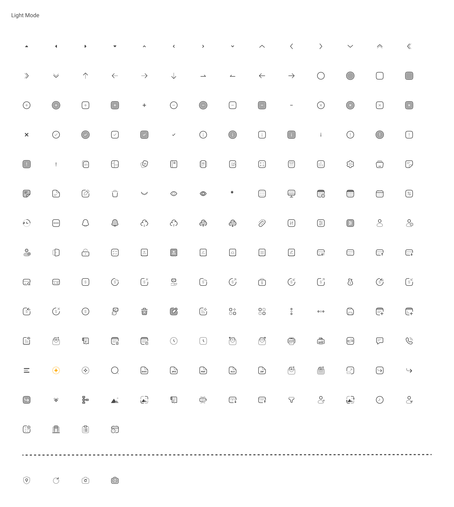

# Espil icons

packege of icons design by Mohamad esfilar

## install

```bash
npm install espil-icons
```

## Usage/Examples

```js
import Icons, { AcceptedReceipt } from "espil-icons";

function App() {
  return (
    <>
      <AcceptedReceipt
        width={"24px"}
        height={"24px"}
        color="red"
        onClick={() => alert("clicked!")}
        className="cursor-pointer"
      />

      <Icons
        name="InfoSquareOutline"
        color="green"
        size={60}
        onClick={() => alert("clicked!")}
        className="cursor-pointer"
      />
    </>
  );
}
```

## Screenshot



## Author

- [@meisam25970](https://www.github.com/meisam25970)
