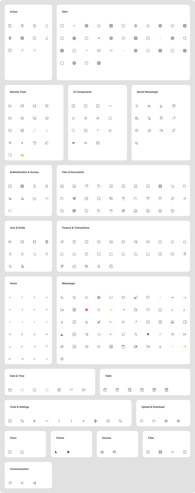

# 🌟 espil-icons

**espil-icons** is a clean and lightweight icon library made for React and TypeScript.
Browse over 100+ modern and flexible SVG icons — fully customizable, and ready to use with one import.

> 🖼️ Live Demo: [espil-icons.mv-team.ir](https://espil-icons.mv-team.ir)



---

## ✨ Features

- ⚡ **Fast & Lightweight** – No dependencies.
- 🎨 **Customizable** – Easily change size, color, and more.
- ⚛️ **Built for React** – Simple component-based usage.
- 🔐 **TypeScript support** – Full typings for safer dev experience.
- 🌐 **Live Preview** – Try icons interactively on the [demo site](https://espil-icons.mv-team.ir).

---

## 📦 Installation

```bash
npm install espil-icons
# or
yarn add espil-icons
```

---

## 🧩 Usage

You have two options for using the icons:

### ✅ Option 1: Named Import (Recommended for Tree Shaking)

```tsx
import { AcceptedReceipt } from "espil-icons";

function App() {
  return (
    <AcceptedReceipt
      width="24px"
      height="24px"
      color="red"
      onClick={() => alert("clicked!")}
      className="cursor-pointer"
    />
  );
}
```

- ✅ No need to pass a `name` prop.
- 🎯 Pass `width` and `height` as strings.

---

### ✅ Option 2: Default Import with Dynamic Name

```tsx
import Icons from "espil-icons";
import type { IconsName } from "espil-icons";

function App() {
  const iconName: IconsName = "InfoSquareOutline";

  return (
    <Icons
      name={iconName}
      size={60} // size in number (applies to both width & height)
      color="green"
      onClick={() => alert("clicked!")}
      className="cursor-pointer"
    />
  );
}
```

- ✅ Use this if you want to render icons dynamically.
- 💡 Must provide a `name` of type `IconsName`.
- 📏 Use `size` (number) for both width and height.

---

## 🔍 Available Icons

See the full list of icons with search and live preview:
👉 **[espil-icons.mv-team.ir](https://espil-icons.mv-team.ir)**

---

## 🧠 Why espil-icons?

Unlike bulky icon packs, espil-icons is built for performance and simplicity.
Its design is minimal, clear, and developer-friendly — made to speed up your UI workflow.

---

## 🛠 Props

### Named Import Icon Component (e.g. `AcceptedReceipt`)

| Prop        | Type         | Default          | Description                   |
| ----------- | ------------ | ---------------- | ----------------------------- |
| `width`     | `string`     | `"24px"`         | Width of the icon             |
| `height`    | `string`     | `"24px"`         | Height of the icon            |
| `color`     | `string`     | `"currentColor"` | Icon color                    |
| `onClick`   | `() => void` | `undefined`      | Click handler                 |
| `className` | `string`     | `""`             | Tailwind / custom CSS classes |

### Default Icon Component (e.g. `Icons`)

| Prop        | Type         | Default          | Description                          |
| ----------- | ------------ | ---------------- | ------------------------------------ |
| `name`      | `IconsName`  | **required**     | Icon name to render                  |
| `size`      | `number`     | `24`             | Icon size in pixels (width & height) |
| `color`     | `string`     | `"currentColor"` | Icon color                           |
| `onClick`   | `() => void` | `undefined`      | Click handler                        |
| `className` | `string`     | `""`             | Tailwind / custom CSS classes        |

---

## 📈 Stats


---

## 📮 Contribution

Pull requests are welcome!
New icon suggestions? Open an issue or contact [@meisam25970](https://npmjs.com/~meisam25970).

---

## 📜 License

ISC License — free for personal and commercial use.

---

### Made with ❤️ by [@meisam25970](https://github.com/meisam25970)
